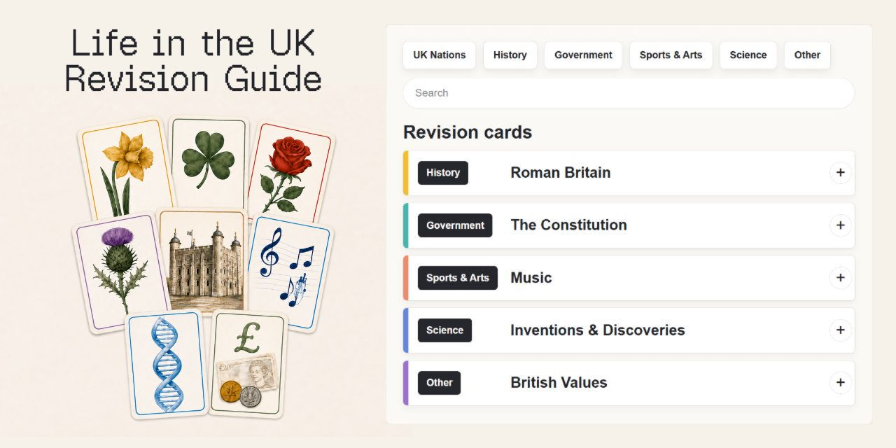

# Life in the UK Revision Guide



An offline-friendly revision guide with searchable topic cards, collapsible sections, focus mode, and CSV-based revision highlighting.

## Open the Guide

Online: [jessiega0.github.io/UK-Revision-Guide](https://jessiega0.github.io/UK-Revision-Guide/)

For offline use, download the repository, extract it, and open `index.html`. Keep `index.html`, `styles.css`, and the `assets` folder together.

## CSV Revision Highlighting

For the most reliable results, upload the CSV downloaded from the Life in the UK test website. CSV files from other sources or with different structures may not identify every question correctly.

Select the Upload CSV button, shown as an upward arrow near the bottom-right corner, and choose one or more question files. Matching revision cards receive a red pill. Files are processed locally in the browser and are not uploaded by this guide.

### Recommended Table Format

| Column | Requirement | How it is used |
| --- | --- | --- |
| `Question Number` | Optional | Kept as a reference; not used for matching. |
| `Question` | Required | Compared with the question on each revision card. |
| `Your Answer(s)` | Optional | Ignored by the matcher. |
| `Correct Answer(s)` | Recommended | Confirms the correct card when the question wording differs. |
| `Explanation` | Optional | Ignored by the matcher. |

Minimal example:

```csv
Question,Correct Answer(s)
Who designed the Cenotaph?,Edwin Lutyens
Who was reigning when settlers began colonising America?,Elizabeth I
```

Recognised question-column names are `Question`, `Question Text`, `Incorrect Question`, `Prompt`, and `Query`.

Recognised correct-answer column names are `Correct Answer`, `Correct Answers`, `Correct Answer(s)`, and `Expected Answer`.

The importer accepts comma-, tab-, semicolon-, and pipe-separated files. A plain text file containing one question per line is also accepted, but without a correct-answer column only exact or extremely close question matches are possible.

### Matching Behaviour

The importer first looks for the same question while ignoring capitalisation, punctuation, and repeated spaces. If the wording differs, it can use the correct answer to confirm one uniquely strong card match. It can also recognise a reversed question-and-answer relationship when both sides clearly agree.

`True`, `False`, `Yes`, and `No` never provide positive matching evidence. An answer is never sufficient on its own, and uncertain or ambiguous matches are left unflagged.

Red-pill selections remain in that browser until Reset is selected. The page position and expanded sections are remembered for 30 minutes, after which the guide returns to its default viewpoint while retaining the red-pill selections.

## Controls

| Control | Action |
| --- | --- |
| Expand | Opens all revision sections. |
| Collapse | Closes all revision sections. |
| Upload CSV | Opens the file picker and highlights matching revision cards. |
| Search/Top | Returns to the top and places the cursor in Search. |
| Take Quiz | Opens the Life in the UK quiz website in a new tab. |
| Focus mode | Shows only the current revision selection. |
| Reset | Removes all imported red-pill selections from this browser. |
| Previous / Next | Moves between highlighted cards. |

## Privacy and Offline Use

The guide has no server-side upload step. CSV processing happens in the browser. All pictures and title fonts are included in `assets`, so the complete guide can be used offline.
